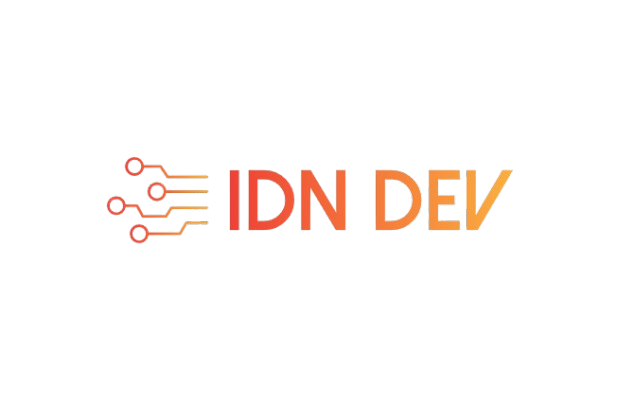

# Título do Projeto

Uma breve descrição sobre o que esse projeto faz e para quem ele é


## Documentação da API

#### Retorna todos os itens

```http
  GET /{tenant}/Pessoa/${id}
```

| Parâmetro   | Tipo       | Obrigatório | Descrição                          |
| :---------- | :--------- | :---------  |:---------------------------------- |
| `Id` | `Guid` | **Sim**| A chave da sua API |

#### Retorna Pessoa

```http
  GET /{tenant}/Departamento/${id}
```

| Parâmetro   | Tipo       | Obrigatório |Descrição                                   |
| :---------- | :--------- | :---------  |:------------------------------------------ |
| `id`      | `Guid` | **Sim**| O ID do item que você quer |

#### Retorna Departamento


## Apêndice

Coloque qualquer informação adicional aqui


## Stack utilizada

**Back-end:** C#, .Net-8


## Etiquetas

Adicione etiquetas de algum lugar, como: [shields.io](https://shields.io/)

[](https://choosealicense.com/licenses/mit/)
[](https://opensource.org/licenses/)
[](http://www.gnu.org/licenses/agpl-3.0)

